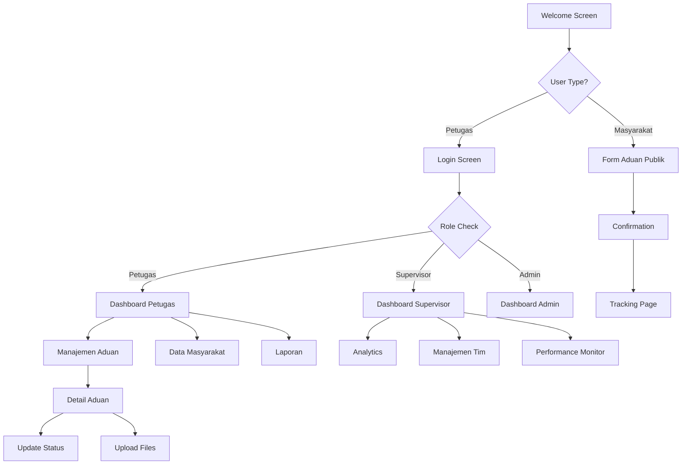

# 🗺️ SIPRIMA DESA TARABBI - UI FLOW & WIREFRAME

## 📋 NAVIGATION FLOW OVERVIEW

### 🌊 **USER JOURNEY MAPPING**



---

## 🏠 **SCREEN FLOW DETAILS**

### 1. **WELCOME → LOGIN FLOW**

```
┌─────────────────────────────────────────────────────────────┐
│                    WELCOME SCREEN                           │
│                                                             │
│  🏛️ LOGO DESA TARABBI                                      │
│  "Melayani Dengan Hati, Mendengar Setiap Aspirasi"        │
│                                                             │
│  ┌─────────────┐    ┌─────────────┐                       │
│  │ 🔐 MASUK    │    │ 📋 DAFTAR   │                       │
│  │   SISTEM    │    │   ADUAN     │                       │
│  └─────────────┘    └─────────────┘                       │
│         │                    │                             │
│         ▼                    ▼                             │
└─────────────────────────────────────────────────────────────┘
         │                    │
         ▼                    ▼
┌─────────────────┐    ┌──────────────────┐
│   LOGIN SCREEN  │    │  FORM ADUAN      │
│                 │    │  MASYARAKAT      │
│ 👤 Username     │    │                  │
│ 🔒 Password     │    │ 👤 Data Pelapor  │
│ 🎯 Role Select  │    │ 📋 Detail Aduan  │
│                 │    │ 📎 Lampiran      │
│ [🚪 LOGIN]      │    │                  │
└─────────────────┘    │ [📤 KIRIM]       │
         │              └──────────────────┘
         ▼                       │
┌─────────────────┐              ▼
│   DASHBOARD     │    ┌──────────────────┐
│   (by Role)     │    │   CONFIRMATION   │
└─────────────────┘    │                  │
                       │ ✅ Aduan Terkirim│
                       │ 🔢 No. Tracking  │
                       │                  │
                       │ [🔍 Cek Status]  │
                       └──────────────────┘
```

### 2. **DASHBOARD → ADUAN MANAGEMENT FLOW**

```
┌─────────────────────────────────────────────────────────────┐
│                  DASHBOARD PETUGAS                          │
│                                                             │
│  📊 METRICS CARDS                                          │
│  ┌─────────┐ ┌─────────┐ ┌─────────┐ ┌─────────┐          │
│  │📋 BARU  │ │⚙️ PROSES│ │✅ SELESAI│ │🚨 DARURAT│          │
│  │   12    │ │    8    │ │   89    │ │    2    │          │
│  └─────────┘ └─────────┘ └─────────┘ └─────────┘          │
│                                                             │
│  🚨 PRIORITAS TINGGI LIST                                  │
│  [👁️ Lihat] [📝 Proses] [📞 Hubungi]                        │
└─────────────────────────────────────────────────────────────┘
                           │
                           ▼ [📋 Aduan Menu]
┌─────────────────────────────────────────────────────────────┐
│                  DAFTAR ADUAN                              │
│                                                             │
│  🔍 [Search] ⚙️ [Filter]                                   │
│  Status: [All ▼] Priority: [All ▼] Category: [All ▼]      │
│                                                             │
│  📊 SUMMARY: 156 Total • 22 Baru • 45 Proses • 89 Selesai │
│                                                             │
│  ┌───────────────────────────────────────────────────────┐ │
│  │ 🔴 #001 • DARURAT • Jalan Rusak Parah              │ │
│  │ 📍 Jl. Mawar Raya • 👤 Siti Aminah • ⏰ 2h ago      │ │
│  │ [👁️ Detail] [📝 Process] [📞 Contact] [📎 Files]   │ │
│  └───────────────────────────────────────────────────────┘ │
│                           │                                 │
│  [More items...]          ▼ [👁️ Detail]                    │
└─────────────────────────────────────────────────────────────┘
                           │
                           ▼
┌─────────────────────────────────────────────────────────────┐
│                  DETAIL ADUAN #001                         │
│                                                             │
│  🔴 DARURAT • Jalan Rusak Parah                           │
│  📅 Created: 16 Jun 2025 • 📊 Status: 🆕 BARU              │
│                                                             │
│  👤 REPORTER INFO          📍 LOCATION INFO               │
│  📋 DESCRIPTION                                            │
│  📎 ATTACHMENTS                                            │
│                                                             │
│  ⚙️ HANDLING SECTION                                       │
│  Petugas: [Select ▼] Estimasi: [Days]                     │
│  [🚀 Start Process] [👥 Assign] [📞 Contact]               │
│                                                             │
│  📊 STATUS HISTORY                                         │
│  • ✅ Aduan diterima sistem                                │
│  • 🔄 Validasi admin                                       │
│  • ⏳ Menunggu penugasan...                                │
└─────────────────────────────────────────────────────────────┘
```

### 3. **SUPERVISOR DASHBOARD FLOW**

```
┌─────────────────────────────────────────────────────────────┐
│                DASHBOARD SUPERVISOR                         │
│                                                             │
│  📈 PERFORMANCE METRICS                                    │
│  ┌─────────┐ ┌─────────┐ ┌─────────┐ ┌─────────┐          │
│  │📊 PERFORMA│ │👥 TIM   │ │⏱️ RESPONSE│ │🏆 TOP   │          │
│  │  92.5%   │ │ 12/15   │ │ 1.2 jam │ │ FEBRY   │          │
│  └─────────┘ └─────────┘ └─────────┘ └─────────┘          │
│                                                             │
│  📊 ANALYTICS CHARTS                                       │
│  🏗️ Infrastruktur  ████████████████░░  67%                │
│  🗑️ Kebersihan     ████████░░░░░░░░░░  45%                │
│  ⚡ Utilitas       ██████░░░░░░░░░░░░  34%                │
│                                                             │
│  🚨 ALERTS & MONITORING                                    │
│  • ⚠️ 2 aduan DARURAT > 1 jam                              │
│  • 📊 Response time naik 15 menit                          │
│  • 👥 3 petugas offline > 2 jam                            │
└─────────────────────────────────────────────────────────────┘
                           │
                           ▼ [📊 Analytics]
┌─────────────────────────────────────────────────────────────┐
│                   ANALYTICS DETAIL                         │
│                                                             │
│  📈 PERFORMANCE TRENDS                                     │
│  📊 CATEGORY BREAKDOWN                                     │
│  🗺️ GEOGRAPHICAL DISTRIBUTION                              │
│  ⏰ TIME-BASED ANALYSIS                                    │
│  👥 TEAM PERFORMANCE                                       │
│                                                             │
│  📋 ACTIONABLE INSIGHTS                                    │
│  💡 RECOMMENDATIONS                                        │
│  📤 EXPORT REPORTS                                         │
└─────────────────────────────────────────────────────────────┘
```

---

## 🎨 **COMPONENT INTERACTION FLOWS**

### 🔘 **BUTTON INTERACTION STATES**

```
PRIMARY BUTTON FLOW:
┌─────────────────────┐    ┌─────────────────────┐    ┌─────────────────────┐
│     🔵 NORMAL       │ →  │     🔷 HOVER        │ →  │     🔹 ACTIVE       │
│  PRIMARY ACTION     │    │  PRIMARY ACTION     │    │  PRIMARY ACTION     │
└─────────────────────┘    └─────────────────────┘    └─────────────────────┘
                                                                │
                                                                ▼
                                                       ┌─────────────────────┐
                                                       │     ⏳ LOADING     │
                                                       │  Processing...      │
                                                       └─────────────────────┘
                                                                │
                                                                ▼
                               ┌─────────────────────┐    ┌─────────────────────┐
                               │     ❌ ERROR        │ or │     ✅ SUCCESS      │
                               │  Try Again          │    │  Completed!         │
                               └─────────────────────┘    └─────────────────────┘
```

### 📝 **FORM INTERACTION FLOW**

```
FORM VALIDATION FLOW:
┌─────────────────────────────────────┐
│           FORM INPUT                │
│                                     │
│  ┌─────────────────────────────┐    │
│  │ 👤 Username                 │    │
│  └─────────────────────────────┘    │
│            │                        │
│            ▼ (on blur/change)       │
│  ┌─────────────────────────────┐    │
│  │ ✅ Valid input              │    │
│  └─────────────────────────────┘    │
│            or                       │
│  ┌─────────────────────────────┐    │
│  │ ❌ Username required        │    │
│  └─────────────────────────────┘    │
│                                     │
│  [🚫 Submit Disabled] or             │
│  [✅ Submit Ready]                   │
└─────────────────────────────────────┘
                │
                ▼ (on submit)
┌─────────────────────────────────────┐
│         FORM SUBMISSION             │
│                                     │
│  ⏳ Processing...                   │
│  [Cancel] [⏳ Submitting...]        │
└─────────────────────────────────────┘
                │
                ▼
┌─────────────────────────────────────┐
│           RESULT                    │
│                                     │
│  ✅ Success! Data saved             │
│  📨 Notification sent               │
│                                     │
│  [✅ OK] [📋 View Details]          │
└─────────────────────────────────────┘
```

### 🔍 **SEARCH & FILTER FLOW**

```
SEARCH INTERACTION:
┌─────────────────────────────────────────────────────────────┐
│                    SEARCH INTERFACE                        │
│                                                             │
│  🔍 [Search box] ⚙️ [Filter] 📊 [Sort]                      │
│                     │                                       │
│                     ▼ (user types)                         │
│  🔍 ["jalan ru"] ⚙️ [Filter] 📊 [Sort]                     │
│                     │                                       │
│                     ▼ (real-time suggestions)              │
│  ┌─────────────────────────────────────────────────────┐   │
│  │ 💡 Suggestions:                                     │   │
│  │ • Jalan Rusak                                       │   │
│  │ • Jalan Ruas Pasar                                  │   │
│  │ • Jalan Rusak Parah                                 │   │
│  └─────────────────────────────────────────────────────┘   │
│                     │                                       │
│                     ▼ (user selects/enters)                │
│  🔍 ["Jalan Rusak"] ⚙️ [Filter] 📊 [Sort]                  │
│                                                             │
│  📊 Results: 5 found                                       │
│  ┌───────────────────────────────────────────────────────┐ │
│  │ 🔴 #001 • Jalan Rusak Parah - Jl. Mawar              │ │
│  │ 🟡 #045 • Jalan Rusak Sedang - Jl. Melati            │ │
│  │ 🟢 #078 • Jalan Rusak Ringan - Jl. Anggrek           │ │
│  └───────────────────────────────────────────────────────┘ │
│                                                             │
│  [🗑️ Clear Search] [📁 Save Search] [📤 Export Results]    │
└─────────────────────────────────────────────────────────────┘
```

---

## 📱 **RESPONSIVE LAYOUT FLOWS**

### 🖥️ **DESKTOP LAYOUT (1024px+)**

```
┌─────────────────────────────────────────────────────────────┐
│ 🏠 [LOGO] Navigation Menu Items                    👤 User ▼│
├─────────────────────────────────────────────────────────────┤
│                                                             │
│  MAIN CONTENT AREA                                         │
│  ┌──────────────────┐  ┌──────────────────┐               │
│  │   CARD 1         │  │   CARD 2         │               │
│  │                  │  │                  │               │
│  └──────────────────┘  └──────────────────┘               │
│                                                             │
│  ┌──────────────────┐  ┌──────────────────┐               │
│  │   CARD 3         │  │   CARD 4         │               │
│  │                  │  │                  │               │
│  └──────────────────┘  └──────────────────┘               │
│                                                             │
│  DETAILED DATA TABLE                                        │
│  ┌───────────────────────────────────────────────────────┐ │
│  │ # │ Title          │ Status    │ Priority │ Actions    │ │
│  ├───┼────────────────┼───────────┼──────────┼────────────┤ │
│  │001│ Jalan Rusak    │ Baru      │ Darurat  │ [View][Edit]│ │
│  │002│ Lampu Mati     │ Proses    │ Sedang   │ [View][Edit]│ │
│  └───────────────────────────────────────────────────────┘ │
└─────────────────────────────────────────────────────────────┘
```

### 💻 **TABLET LAYOUT (768px - 1023px)**

```
┌─────────────────────────────────────────────────────────────┐
│ ☰ [LOGO]           Navigation               👤 User ▼      │
├─────────────────────────────────────────────────────────────┤
│                                                             │
│  ┌─────────────────────────────┐                           │
│  │         CARD 1              │                           │
│  │                             │                           │
│  └─────────────────────────────┘                           │
│                                                             │
│  ┌─────────────────────────────┐                           │
│  │         CARD 2              │                           │
│  │                             │                           │
│  └─────────────────────────────┘                           │
│                                                             │
│  SIMPLIFIED LIST VIEW                                       │
│  ┌───────────────────────────────────────────────────────┐ │
│  │ 🔴 #001 Jalan Rusak Parah              [Actions ▼]    │ │
│  │ 📍 Jl. Mawar • 👤 Siti • ⏰ 2h ago                     │ │
│  ├───────────────────────────────────────────────────────┤ │
│  │ 🟡 #002 Lampu Jalan Mati               [Actions ▼]    │ │
│  │ 📍 Jl. Melati • 👤 Budi • ⏰ 4h ago                    │ │
│  └───────────────────────────────────────────────────────┘ │
└─────────────────────────────────────────────────────────────┘
```

### 📱 **MOBILE LAYOUT (<768px)**

```
┌─────────────────────────────────────┐
│ ☰          SIPRIMA         👤       │
├─────────────────────────────────────┤
│                                     │
│  ┌─────────────────────────────────┐ │
│  │          CARD 1                 │ │
│  │                                 │ │
│  └─────────────────────────────────┘ │
│                                     │
│  ┌─────────────────────────────────┐ │
│  │          CARD 2                 │ │
│  │                                 │ │
│  └─────────────────────────────────┘ │
│                                     │
│  MOBILE-OPTIMIZED LIST              │
│  ┌─────────────────────────────────┐ │
│  │ 🔴 #001 Jalan Rusak           │ │
│  │ 📍 Jl. Mawar                   │ │
│  │ 👤 Siti • ⏰ 2h ago             │ │
│  │ [👁️] [📝] [📞]                  │ │
│  ├─────────────────────────────────┤ │
│  │ 🟡 #002 Lampu Mati             │ │
│  │ 📍 Jl. Melati                  │ │
│  │ 👤 Budi • ⏰ 4h ago             │ │
│  │ [👁️] [📝] [📞]                  │ │
│  └─────────────────────────────────┘ │
│                                     │
├─────────────────────────────────────┤
│ 🏠  📋  👥  📊  ⚙️               │ Bottom Navigation
└─────────────────────────────────────┘
```

---

## 🔄 **STATE MANAGEMENT FLOWS**

### 📊 **DATA LOADING STATES**

```
DATA FETCH FLOW:
┌─────────────────────┐
│    INITIAL LOAD     │
│                     │
│    ⏳ Loading...    │
│    [spinner]        │
└─────────────────────┘
           │
           ▼
┌─────────────────────┐    ┌─────────────────────┐
│    SUCCESS STATE    │ or │    ERROR STATE      │
│                     │    │                     │
│  📊 Data Loaded     │    │  ❌ Failed to Load  │
│  [content]          │    │  🔄 [Retry]         │
└─────────────────────┘    └─────────────────────┘
           │                         │
           ▼ (user action)            ▼ (retry)
┌─────────────────────┐              │
│   REFRESHING        │              │
│                     │              │
│  🔄 Updating...     │              │
│  [existing content] │              │
└─────────────────────┘              │
           │                         │
           ▼                         │
┌─────────────────────┐              │
│   UPDATED STATE     │◄─────────────┘
│                     │
│  ✅ Data Updated    │
│  [new content]      │
└─────────────────────┘
```

### 🔔 **NOTIFICATION FLOW**

```
NOTIFICATION SYSTEM:
┌─────────────────────────────────────────────────────────────┐
│                    APPLICATION                              │
│                                                             │
│  ┌─────────────────────────────────────────────────────┐   │
│  │                 NOTIFICATION AREA                   │   │
│  │                                                     │   │
│  │  ✅ Success: Aduan berhasil disimpan               │   │
│  │  ⚠️ Warning: Respons time melebihi target          │   │
│  │  ❌ Error: Gagal mengirim notifikasi              │   │
│  │  ℹ️ Info: Update sistem akan dilakukan besok       │   │
│  │                                                     │   │
│  │  [❌ Dismiss All]                                   │   │
│  └─────────────────────────────────────────────────────┘   │
│                                                             │
│  MAIN CONTENT AREA                                         │
│                                                             │
│  ┌─────────────────┐ Auto-dismiss after 5s               │
│  │  ✅ Tersimpan!  │←─────────────────────────────────────│
│  └─────────────────┘                                      │
│                                                             │
└─────────────────────────────────────────────────────────────┘

TOAST NOTIFICATION TYPES:
┌─────────────────────┐ ┌─────────────────────┐ ┌─────────────────────┐
│  ✅ SUCCESS         │ │  ⚠️ WARNING         │ │  ❌ ERROR           │
│  Auto-dismiss: 3s   │ │  Auto-dismiss: 5s   │ │  Manual dismiss     │
│  Green theme        │ │  Orange theme       │ │  Red theme          │
└─────────────────────┘ └─────────────────────┘ └─────────────────────┘
```

---

## 🎯 **ACCESSIBILITY FLOW**

### ⌨️ **KEYBOARD NAVIGATION**

```
KEYBOARD NAVIGATION PATH:
┌─────────────────────────────────────────────────────────────┐
│ TAB ORDER: 1→2→3→4→5→6→7→8                                  │
│                                                             │
│  [1]🏠 Home [2]📋 Aduan [3]👥 Users [4]📊 Reports [5]👤 Profile │
│                                                             │
│  MAIN CONTENT:                                             │
│  [6]🔍 Search: ________________                             │
│                                                             │
│  [7]📋 ADUAN LIST:                                         │
│  ┌───────────────────────────────────────────────────────┐ │
│  │ FOCUS INDICATOR: Blue border + shadow                  │ │
│  │ 🔴 #001 Jalan Rusak Parah                             │ │
│  │ SPACE/ENTER: Open detail                               │ │
│  └───────────────────────────────────────────────────────┘ │
│                                                             │
│  [8]🔄 Pagination: [Prev] [1] [2] [3] [Next]               │
│                                                             │
│  KEYBOARD SHORTCUTS:                                       │
│  • Ctrl+/ : Focus search                                   │
│  • Ctrl+N : New item                                       │
│  • ESC    : Close modal/drawer                             │
│  • Arrow keys : Navigate lists                             │
└─────────────────────────────────────────────────────────────┘
```

### 🔊 **SCREEN READER SUPPORT**

```
SCREEN READER FLOW:
┌─────────────────────────────────────────────────────────────┐
│                 ARIA LABELS & ROLES                        │
│                                                             │
│ <nav role="navigation" aria-label="Main navigation">       │
│   <ul>                                                      │
│     <li><a href="/" aria-current="page">Home</a></li>       │
│     <li><a href="/aduan">Aduan Management</a></li>          │
│   </ul>                                                     │
│ </nav>                                                      │
│                                                             │
│ <main role="main" aria-label="Dashboard content">          │
│   <section aria-labelledby="stats-heading">                │
│     <h2 id="stats-heading">Statistics Overview</h2>        │
│     <div role="group" aria-label="Aduan statistics">       │
│       <div role="img" aria-label="12 new complaints">      │
│         📋 BARU: 12                                         │
│       </div>                                                │
│     </div>                                                  │
│   </section>                                                │
│                                                             │
│   <table role="table" aria-label="Complaints list">        │
│     <thead>                                                 │
│       <tr>                                                  │
│         <th scope="col">ID</th>                             │
│         <th scope="col">Title</th>                          │
│         <th scope="col">Status</th>                         │
│         <th scope="col">Actions</th>                        │
│       </tr>                                                 │
│     </thead>                                                │
│     <tbody>                                                 │
│       <tr>                                                  │
│         <td>001</td>                                        │
│         <td>Jalan Rusak Parah</td>                          │
│         <td><span aria-label="Priority: Emergency">🔴</span></td> │
│         <td>                                                │
│           <button aria-label="View details for complaint 001"> │
│             👁️ View                                        │
│           </button>                                         │
│         </td>                                               │
│       </tr>                                                 │
│     </tbody>                                                │
│   </table>                                                  │
│ </main>                                                     │
└─────────────────────────────────────────────────────────────┘

SCREEN READER ANNOUNCEMENTS:
• Page load: "Dashboard loaded. 12 new complaints, 8 in progress"
• Action success: "Complaint status updated to in progress"
• Form error: "Error: Title field is required"
• Navigation: "Navigated to Aduan Management page"
```

---

## 📋 **IMPLEMENTATION CHECKLIST**

### ✅ **UI FLOW REQUIREMENTS**

#### 🏗️ **Structure & Navigation**
- [ ] Welcome screen with clear CTAs
- [ ] Login flow with role-based routing
- [ ] Dashboard layouts per user role
- [ ] Consistent navigation across all screens
- [ ] Breadcrumb navigation for deep pages

#### 🎨 **Visual Interactions**
- [ ] Button hover/active/loading states
- [ ] Form validation feedback
- [ ] Loading spinners and progress indicators
- [ ] Toast notifications system
- [ ] Modal and drawer interactions

#### 📱 **Responsive Behavior**
- [ ] Mobile-first navigation (hamburger menu)
- [ ] Tablet-optimized layouts
- [ ] Desktop multi-column layouts
- [ ] Touch-friendly button sizes
- [ ] Swipe gestures for mobile

#### ♿ **Accessibility**
- [ ] Keyboard navigation support
- [ ] Screen reader compatibility
- [ ] Focus indicators
- [ ] ARIA labels and roles
- [ ] High contrast mode support

#### 🔄 **State Management**
- [ ] Loading states
- [ ] Error handling
- [ ] Success feedback
- [ ] Form validation states
- [ ] Real-time updates

---

## 🚀 **NEXT DEVELOPMENT PHASE**

### 📋 **Phase 1: Core Components (Week 1)**
1. Setup base theme system
2. Create core UI components
3. Implement navigation structure
4. Basic form components

### 📋 **Phase 2: Screen Implementation (Week 2)**
1. Welcome and login screens
2. Dashboard layouts
3. List and detail views
4. Form screens

### 📋 **Phase 3: Interactions & Polish (Week 3)**
1. Add loading states
2. Implement notifications
3. Form validation
4. Responsive optimizations

### 📋 **Phase 4: Accessibility & Testing (Week 4)**
1. Keyboard navigation
2. Screen reader support
3. Cross-browser testing
4. Performance optimization

---

*📝 Dokumentasi ini berfungsi sebagai panduan implementasi UI flow untuk development team*

**Author**: SIPRIMA Development Team  
**Version**: 1.0  
**Last Updated**: 16 Juni 2025

